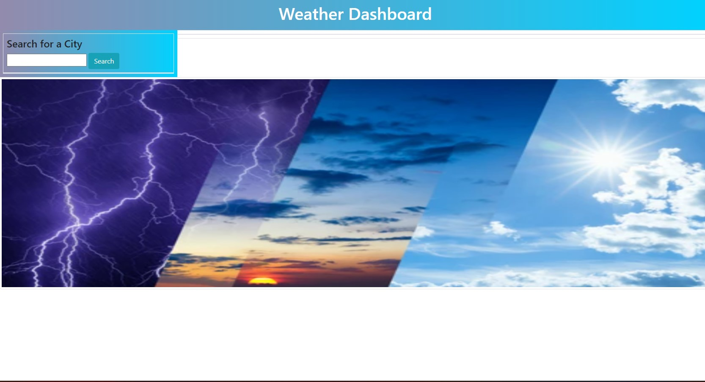
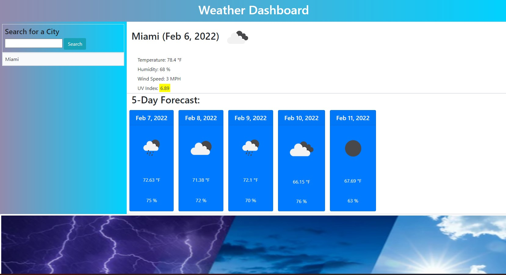

# Weather Forecast

## Website  https://blerandism.github.io/weather_forecast/
The task was to build a weather website with active API to help the user get actual weather forecast for 5 days for the city of their choice. 

When they enter the website they have the option to enter a city in the search box
 - 

After they enter the city and click the seearch button the event listener will activate the function and show the citys weather for the upcoming 5 days. 
- 

The website will show the temperature, UV index, weather conditions and the corresponding icon for those conditions.
Previous searches are saved in localStorage and the five (5) most recent searches are available as buttons in order for easy access and re-searching of weather and forecasts

# Contributors 
- **Blerand Ismaili**  https://github.com/BlerandIsm/weather_forecast

